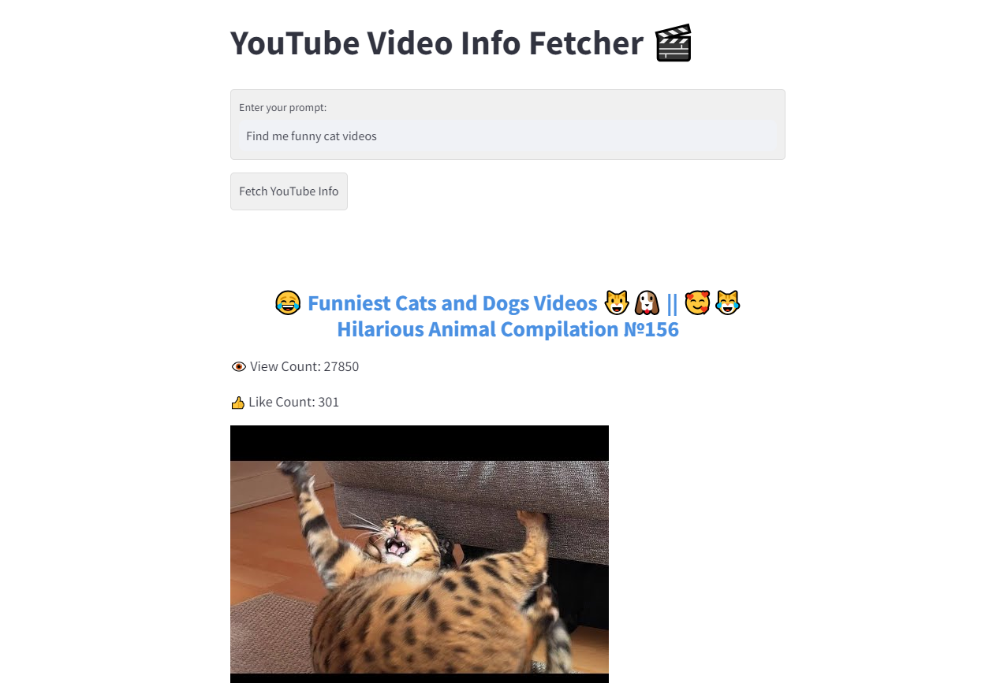

# YouTube Video Info Fetcher 🎬

Welcome to the **YouTube Video Info Fetcher**! This web app, powered by Streamlit, allows users to find multiple YouTube videos based on a given prompt.

 

## Features 🌟

- Input a custom prompt to search for videos.
- Fetches details like:
  - Video Name
  - View Count
  - Like Count
  - Thumbnail (which is also a clickable link to the actual video)
  
## Prerequisites 📝

Ensure you have the following installed on your local machine:

- Python 3.x
- pip

## Setup and Installation ⚙️

1. **Clone the repository:**

   ```
   git clone https://github.com/efeakm/LLM-youtube-searcher.git
   cd LLM-youtube-searcher
   ```

2. **Set up a virtual environment (optional but recommended):**

   ```
   python3 -m venv venv
   source venv/bin/activate  # For Windows, use `venv\Scripts\activate`
   ```

3. **Install the required packages:**

   ```
   pip install -r requirements.txt
   ```

4. **Run the Streamlit app:**

   ```
   streamlit run app.py
   ```

   This will open a new tab in your web browser with the app running.

## Contributing 🤝

Feel free to open issues or PRs if you want to contribute to the project! 

## License 📄

This project is licensed under the Apache License - see the [LICENSE.md](LICENSE.md) file for details.